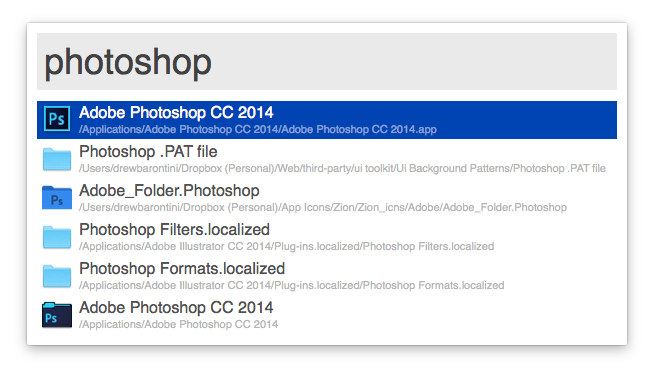
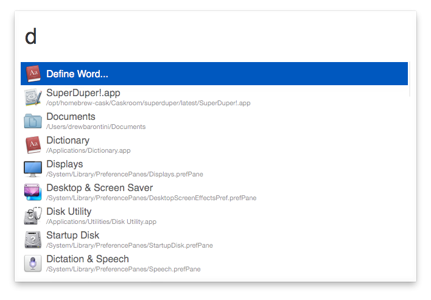
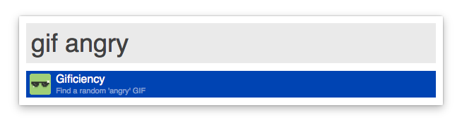

Alfred Themes and Workflows
===========================

My personal themes and workflows for [Alfred](http://alfredapp.com/).

Themes
------

_Download the Theme and double-click on the file to install in Alfred._

**Note**: You _must_ have the [Alfred PowerPack](http://www.alfredapp.com/powerpack/) installed.

### Minimal Light

[Download Theme](http://drewb.io/download/Minimal%20Light.alfredappearance)

### Yosemite (Custom)

[Download Theme](http://drewb.io/download/Yosemite%20(Custom).alfredappearance)

Workflows
---------

_Download the Workflow and double-click on the file to install in Alfred._

**Note**: You _must_ have the [Alfred PowerPack](http://www.alfredapp.com/powerpack/) installed.

### Gificiency

A Workflow to grab a GIF in a specificed category from [Gificiency](http://gificiency.com).

- `gif <category>` will grab a random GIF in the specified category and paste it to your clipboard.
- `gif random` will grab a random GIF across _all_ the GIFs and pasted it to your clipboard.

[Download Workflow](http://drewb.io/download/Gificiency.alfredworkflow)

